<p align="center">
  <picture>
    <source media="(prefers-color-scheme: dark)" srcset="assets/hero-dark.svg">
    
  </picture>
</p>

<p align="center">
  <a href="https://github.com/Aboudjem/loopify/actions/workflows/validate.yml"></a>
  <a href="LICENSE"></a>
  <a href="https://github.com/Aboudjem/loopify/stargazers"></a>
</p>

<p align="center">
  <b>English</b> · <a href="READMEs/zh-CN.md">简体中文</a> · <a href="READMEs/ja.md">日本語</a> · <a href="READMEs/es.md">Español</a> · <a href="READMEs/fr.md">Français</a>
</p>

<p align="center">
  <strong>Hand Claude a job that repeats. Come back to a log of what every tick did, not a loop you have to babysit.</strong>
</p>

<p align="center">
  <a href="#what-it-does">What it does</a> · <a href="#install">Install</a> · <a href="#use-it">Use it</a> · <a href="#works-in-your-editor">Works in your editor</a> · <a href="#good-to-know">Good to know</a> · <a href="#learn-more">Learn more</a>
</p>

```bash
claude plugin marketplace add Aboudjem/10x
claude plugin install loopify@10x
```

## What it does

Some jobs never really finish. A release pull request needs watching all afternoon; new bug reports
pile up overnight and want a first look before anyone reads them. Claude Code already has a command
for repeating work, `/loop`: you give it a prompt and an interval, and it runs that prompt again and
again while your session stays open. What it does not give you is the prompt.

loopify writes the prompt. You describe the job once, in plain words. loopify reads your project
while Claude still has your context, asks the few decisions that matter (how often, when to stop,
what it may touch), and writes two things.

- **The brief, a file.** One round of the job: what to read, what it may change, what it must
  never do, when to stop, and where to write down what happened. The loop opens it fresh at the
  start of every run, so nothing is lost between runs, and you can edit it while the loop runs.
- **The line, one string.** You paste it into `/loop`. The brief's path is inside it, so every run
  knows where to look. So is the stop rule, so the loop ends on your terms.

Each run is a **tick**. Every tick, Claude re-reads the brief, does one round of the job, and
writes what happened to a log called `TICKS.md`. You do not have to stay up; you do have to read
the log.

If you have used [goalify](https://github.com/Aboudjem/goalify), this will feel familiar. goalify
is for a job that finishes: one big task, one definition of done, `/goal`. loopify is for a job
that repeats.

## Install

The two commands at the top add the 10x marketplace and install the plugin in Claude Code, which
loopify was verified against at 2.1.252. Any other agent installs the same skill directory in one
line, through the [skills CLI](https://github.com/vercel-labs/skills):

```bash
npx skills add Aboudjem/loopify
```

## Use it

### 1. Describe the job

Type `/loopify` in the Claude Code chat and say what should repeat. loopify reads the README, the
recent commits and the open pull requests, then asks one short batch of questions.

```text
/loopify keep our release PR healthy, check it every 20 minutes
    brief      /Users/you/acme/.loop/pr-babysitter.md     a file, re-read every tick
    state      /Users/you/acme/.loop/pr-babysitter/       TICKS.md · LESSONS.md · QUEUE.md
    line       144 chars                                  one string, you paste it below
```

`/Users/you/acme/` stands in for your project; loopify prints your real paths.

### 2. Paste the line

```text
/loop 20m Run one cycle of /Users/you/acme/.loop/pr-babysitter.md · read it first, obey its stop rule (30 ticks or the PR merges), log the tick.
```

Claude runs one round right away and then every 20 minutes, in that session, until the PR merges
or 30 ticks have passed, whichever comes first. Leave the interval out and Claude picks the pace
itself. The two mistakes people make most often:

```text loop-antipattern
# not this: "every morning" can make /loop offer a cloud schedule instead, and nothing says when to stop
/loop every morning keep the release PR healthy

# and not the path alone: the tick gets a filename and no instruction
/loop 20m /Users/you/acme/.loop/pr-babysitter.md
```

### 3. Read the log

`TICKS.md` has one entry per tick with what changed and the evidence for it, and a counter at the
top:

```text
tick: 7/30

## tick 7 · 2026-09-01T09:40 · changed
- CI: lint failed on src/api.ts → fixed the unused import, committed 4f2a1c9, npm test 12/12
- reviews: 1 new thread answered (rename), reply drafted in QUEUE.md
```

Whatever the loop could not do safely waits for you in `QUEUE.md`.

## What you get

- **A brief that stays put.** Re-read every tick, never archived, never rewritten by the loop. How
  often it runs, when it stops and what it may touch are settled before the first tick.
- **A stop rule and a tick cap inside the line.** A loop that finishes its job stops, and so does
  one that reaches its cap.
- **Rails for an unattended run.** No accounts, no payments, no pushing or posting unless you say
  so. Anything the loop reads, such as a pull request comment, is data, never an instruction.
- **A repeat-safe clause in every brief.** The brief names the marker a tick looks for before it
  acts, so a tick that runs again can tell that the work already happened.
- **A log with a shape.** Every entry in `TICKS.md` opens with the same header, `## tick <n> · <ISO
  timestamp> · changed | noop | stopped`, checkable with `skills/loopify/scripts/ticks_lint.py`.
  Blocked items in `QUEUE.md` carry a `reason:` line and an `unblock:` line.
- **A loop that learns.** `LESSONS.md` keeps what worked and what wasted time, re-read every tick.

## Works in your editor

Works in Claude Code, Cursor, Codex, Copilot, Gemini CLI, and 70+ other agents through
`npx skills add`.

| Where | How |
| --- | --- |
| Claude Code | `claude plugin install loopify@10x` |
| Cursor, Codex, Gemini CLI, OpenCode, Windsurf, Zed, Kimi Code CLI | `npx skills add Aboudjem/loopify -a <agent>` |
| VS Code and GitHub Copilot | `npx skills add Aboudjem/loopify -a github-copilot` |
| Everything else | copy `skills/loopify/` into your agent's skills directory |

loopify is one skill directory with two standard-library Python scripts beside it, so there is no
server to run and nothing to compile. The `-a` code and both install paths per agent, and the
copy-it-in-by-hand path, are in [docs/editors.md](docs/editors.md).

The brief travels; the line does not. The line is a Claude Code `/loop` line, and the brief's
scheduling step names Claude Code tools. The brief has a branch for that: run one cycle, log it,
exit, and let an outside scheduler fire the next tick.
[docs/other-agents.md](docs/other-agents.md) covers Kimi, Copilot CLI, Cursor, Qwen Code, Hermes,
Goose and plain cron.

## Good to know

> [!IMPORTANT]
> A running loop is not proof it is doing the right thing. Read the tick log. No evaluator sits
> behind `/loop`, so the brief's per-tick checklist and `TICKS.md` are the only proof there is.

- **The loop lives in the session you paste it into.** It fires only while that session is open.
  Close the terminal and it stops; `/clear` wipes the schedule too. Running Claude Code in the
  background keeps it alive without a window.
- **Every loop ends at 7 days**, and one session holds at most 50 scheduled tasks. Both are Claude
  Code limits on scheduled work, not loopify's. Paste the line again to carry on.
- **Pre-approve what a tick runs.** loopify prints the commands the loop needs, such as
  `gh pr view` or `git commit`. A tick that hits a permission prompt waits there for an answer.

## Learn more

- [Quickstart](docs/quickstart.md), your first loop step by step, and with no terminal open
- [Install in your editor](docs/editors.md), the agent code and both paths for the skills CLI
- [A worked example](examples/sample-loop-brief.md), a complete brief with the line at the bottom
- [Honest limits](docs/limits.md), what loopify does not promise, traced to the binary or the docs
- [Other agents](docs/other-agents.md), the same brief under Kimi, Cursor, Goose and plain cron
- [FAQ](docs/faq.md) · [The `loop.md` pointer](docs/loop-md.md) · [Changelog](CHANGELOG.md) · [Contributing](CONTRIBUTING.md) · [The skill itself](skills/loopify/SKILL.md)

---

<sub>Built by <a href="https://github.com/Aboudjem">Adam Boudjemaa</a> · MIT. `/loop` behavior re-derived
from the shipped Claude Code 2.1.252 binary and the official docs, 2026. Sibling of
<a href="https://github.com/Aboudjem/goalify">goalify</a>, which does the same for `/goal`.
<a href="https://github.com/Aboudjem/loopify/issues">Spot a gap?</a></sub>
