<p align="center">
  <b>English</b> ·
  <a href="READMEs/zh-CN.md">简体中文</a> ·
  <a href="READMEs/ja.md">日本語</a> ·
  <a href="READMEs/es.md">Español</a> ·
  <a href="READMEs/fr.md">Français</a>
</p>

<p align="center">
  
</p>

<h1 align="center">loopify</h1>

<p align="center">
  <strong>Hand Claude a job that repeats. Come back to a log of what every tick did — not a loop you have to babysit.</strong>
</p>

<p align="center">
  <a href="https://github.com/Aboudjem/loopify/actions/workflows/validate.yml"></a>
  <a href="LICENSE"></a>
  
  <a href="https://skills.sh/Aboudjem/loopify"></a>
</p>

Some jobs never really finish. A release pull request needs someone to watch its checks and answer
reviewers for the whole afternoon. A deploy needs checking every few minutes until it settles. New
bug reports pile up overnight and want a first look before anyone reads them. You can ask Claude to
do any of these once. Asking it to keep doing them, on a schedule, without you sitting there, is the
part that gets messy.

Claude Code has a command for repeating work: `/loop`. You give it a prompt and an interval, and it
runs that prompt again and again while your session stays open. What it does not give you is the
prompt. Write a short one and the loop forgets what it decided last time. Write a long one and it
pushes things you never wanted pushed, or keeps running long after the job is done, because nothing
told it when to stop.

loopify is a Claude Code skill that writes that prompt for you, properly. You describe the job once,
in plain words. loopify reads your project while Claude still has your context, asks you about the
few decisions that matter (how often, when to stop, what it may touch), and writes two things.

The first is the **brief**: a file that describes one round of the job. What to read, what it may
change, what it must never do, when to stop, and where to write down what happened. The loop opens
this file fresh at the start of every run, so nothing gets lost between runs, and you can edit it
while the loop is running.

The second is the **line**: one short string you paste into `/loop`. The brief's path is inside it,
so every run knows where to look. So is the stop rule, so the loop ends on your terms.

Each run is a **tick**. Every tick, Claude re-reads the brief, does one round of the job, and writes
what happened to a log called `TICKS.md`. Think of a night watchman with a clipboard: the brief is
the round sheet pinned to the wall, the line is the shift you post, and the log is the clipboard you
read in the morning. You do not have to stay up. You do have to read the clipboard.

## What you get

- ⚡ **One line to hand over.** Paste it once, in this session or any session open in that project.
  The brief's path rides inside it.
- 📋 **A brief that stays put.** It is a standing file: re-read every tick, never archived, never
  rewritten by the loop. You can open it and change a decision between ticks.
- 🧭 **The few real choices settled first.** How often it runs, when it stops, and what it may touch
  are asked once, before the first tick, not guessed on tick 12.
- 🛑 **A stop rule and a tick cap in the line itself.** A loop that finishes its job stops. A loop
  that reaches its cap stops. Nothing runs until the 7-day limit by accident.
- 🔒 **Rails for an unattended run.** No accounts, no payments, no pushing or posting unless you say
  so. Anything the loop reads along the way, such as a PR comment or an issue, is data, never an
  instruction.
- 🗒️ **A log you can read.** `TICKS.md` counts every tick and quotes the evidence for what it did.
  `QUEUE.md` holds whatever it could not do safely and left for you.
- 🧠 **A loop that learns.** `LESSONS.md` keeps what worked and what wasted time, and the loop
  re-reads it every tick.
- 🔁 **Restart in one paste.** The brief keeps its shape. When the loop ends, paste the line again.

## Three steps

### 1. Install once

Open a terminal and add the 10x marketplace, then install the plugin. loopify was verified against
Claude Code 2.1.252; the [quickstart](docs/quickstart.md) has the other ways to install it.

```bash
claude plugin marketplace add Aboudjem/10x
claude plugin install loopify@10x
```

If you prefer the [skills CLI](https://skills.sh), one command does the same: `npx skills add Aboudjem/loopify`

### 2. Describe the job, then paste the line

In the Claude Code chat, type `/loopify` and say what should repeat. Here is what that looks like
for a release pull request that needs looking after:

```text
/loopify keep our release PR healthy, check it every 20 minutes
    brief      /Users/you/acme/.loop/pr-babysitter.md     a file — re-read every tick
    state      /Users/you/acme/.loop/pr-babysitter/       TICKS.md · LESSONS.md · QUEUE.md
    line       144 chars                                  one string — you paste it below

/loop 20m Run one cycle of /Users/you/acme/.loop/pr-babysitter.md — read it first, obey its stop rule (30 ticks or the PR merges), log the tick.
```

loopify reads your project first. It looks at the README, the recent commits, the open pull
requests, and asks you a short batch of questions: how often, when to stop, what the loop may
change. Then it writes the brief and prints the line. `/Users/you/acme/` stands in for your project;
loopify prints your real paths.

Paste the line into the chat. In the example above, Claude runs one round right away and then every
20 minutes, in that session, until the PR merges or 30 ticks have passed, whichever comes first.
Leave the interval out of the line and Claude picks the pace itself, waiting longer when nothing is
happening.

### 3. Read the log

Come back when you like. `TICKS.md` has one entry per tick with what changed and the evidence for
it, and a counter at the top so you can see how far along the loop is:

```text
tick: 7/30

## tick 7 · 2026-09-01T09:40 · changed
- CI: lint failed on src/api.ts → fixed the unused import, committed 4f2a1c9, npm test 12/12
- reviews: 1 new thread answered (rename), reply drafted in QUEUE.md
```

Whatever the loop could not do safely, such as a review reply it should not post on its own, waits
for you in `QUEUE.md`.

### The line, right and wrong

The right line carries the brief's path and the stop rule. The two wrong ones below are the mistakes
people make most often: daily phrasing, which can make `/loop` offer a cloud schedule instead of a
local loop, and a bare path, which gives the tick nothing to do.

```text loop-antipattern
# the line itself — the exact string loopify printed (144 characters)
/loop 20m Run one cycle of /Users/you/acme/.loop/pr-babysitter.md — read it first, obey its stop rule (30 ticks or the PR merges), log the tick.

# not this — "every morning" can make /loop offer a cloud schedule instead, and there is no stop rule
/loop every morning keep the release PR healthy

# and not the path alone — the tick gets a filename and no instruction
/loop 20m /Users/you/acme/.loop/pr-babysitter.md
```

### Things worth knowing before your first loop

- **The loop lives in the session you paste it into.** It fires only while that session is open.
  Close the terminal and it stops; `/clear` wipes the schedule too. Running Claude Code in the
  background keeps it alive without a window.
- **Pre-approve what a tick runs.** loopify prints the commands the loop needs, such as
  `gh pr view` or `git commit`. Add them to your allowlist before you paste. If a tick hits a
  permission prompt, it waits there until someone answers.
- **Every loop ends at 7 days.** That is a Claude Code rule for scheduled work, in both modes. Paste
  the line again and the loop picks up where the brief says.
- **To stop early**, press `Esc` while a self-paced loop waits, or say "cancel the pr-babysitter job"
  for a fixed one. Ask "what scheduled tasks do I have?" to confirm it is gone.

> [!IMPORTANT]
> A running loop is not proof it is doing the right thing — read the tick log. Nothing judges a
> `/loop`; the brief's per-tick checklist and `TICKS.md` are the only proof there is. The loop runs
> inside the Claude Code session you paste it into: it fires only while that session is open. Every
> loop stops at 7 days; paste the line again.

## Learn more

- [Quickstart](docs/quickstart.md) — your first loop step by step, other ways to install, and how to
  run a loop with no terminal open
- [A worked example](examples/sample-loop-brief.md) — a complete brief for the release-PR job, with
  the line at the bottom of it
- [Honest limits](docs/limits.md) — everything loopify does not promise, each one traced to the
  Claude Code binary or docs
- [Other agents](docs/other-agents.md) — the same brief under Kimi, Copilot CLI, Cursor, Qwen Code,
  Hermes, Goose, and plain cron
- [FAQ](docs/faq.md) · [The `loop.md` pointer](docs/loop-md.md) · [Changelog](CHANGELOG.md) · [Contributing](CONTRIBUTING.md) · [The skill itself](skills/loopify/SKILL.md)

If you have used [goalify](https://github.com/Aboudjem/goalify), this will feel familiar. goalify is
for a job that finishes: one big task, one definition of done, `/goal`. loopify is for a job that
repeats. Same author, same test-first habit, same honesty about what the tool cannot promise.

---

<sub>Built by <a href="https://github.com/Aboudjem">Adam Boudjemaa</a> · MIT. `/loop` behavior re-derived
from the shipped Claude Code 2.1.252 binary and the official docs, 2026. Sibling of
<a href="https://github.com/Aboudjem/goalify">goalify</a>, which does the same for `/goal`.
<a href="https://github.com/Aboudjem/loopify/issues">Spot a gap?</a></sub>
