# Quickstart

Hand Claude a job that repeats. Come back to a log of what every tick did, not a loop you have to
babysit. You do the prep once, while Claude still has your project in mind, and what you get back is
one line you can paste whenever you want the loop running.

loopify only **writes** the loop. It does not do the job, and it never starts the loop — you do that,
by pasting the line. It writes two things: a **brief**, the Markdown file every run re-reads before it
does anything, and a **line**, the short string you paste into `/loop`.

Two more words, because the rest of the page uses them. One run of the loop is a **tick**; one pass
through the brief is a **cycle**, and a tick does exactly one cycle. For a pull-request job checked
every 20 minutes, tick 1 is the 09:00 check and tick 2 is the 09:20 check.

---

## 0. What you need before you start

- **Claude Code 2.1.252 or newer.** That is the version loopify's `/loop` behavior was verified
  against — the interval grammar, the 7-day expiry, what `Esc` does and does not stop. Older builds
  may differ. `/loop` is built in; there is nothing to install for it.
- **A job that repeats.** Keeping a release pull request healthy while reviews come in, watching a
  deploy until it settles, sweeping new bug reports, keeping a branch green overnight. If the job
  finishes and then it is over, you want [goalify](https://github.com/Aboudjem/goalify) instead —
  see [when NOT to use it](#when-not-to-use-it).
- **Whatever the job itself needs, already working.** A pull-request job needs `gh` installed and
  logged in; a test-watching job needs a test command that runs today. loopify tries each of them
  read-only during prep, so a broken one surfaces then rather than at 3 a.m. on tick 14.

---

## 1. How to install loopify

**The plugin is the shortest route:**

```shell
claude plugin marketplace add Aboudjem/10x
claude plugin install loopify@10x
```

**Or with the skills CLI**, which knows where each agent keeps its skills:

```shell
npx skills add Aboudjem/loopify
```

That drops the skill into `.claude/skills/` for Claude Code. Pass `-a` to install it into another
agent's skills folder as well — useful if you also run the brief somewhere else
([other agents](other-agents.md)).

**Or copy it in by hand:**

```shell
git clone https://github.com/Aboudjem/loopify.git
mkdir -p ~/.claude/skills
cp -r loopify/skills/loopify ~/.claude/skills/loopify
```

Any of the three gives you `/loopify`, which writes the loop. You start it yourself with Claude
Code's built-in `/loop`.

**Claude Code finds the skill on its own.** Restart it if it was already open — and a brand-new
top-level skills folder usually needs that one restart before Claude Code watches it. To update
later, pull again and re-copy. To remove it, delete `~/.claude/skills/loopify`.

---

<p align="center">
  
</p>

That is one tick. It happens again on the cadence you chose, and it keeps happening until the stop
rule in the brief says otherwise.

## 2. How to set up your first loop

1. **Describe the job in plain language.** Type `loopify this: <the job that repeats>` — for example,
   *"loopify this: keep our release PR healthy, check it every 20 minutes."*

   loopify reads the project, works out what one round of that job actually does, and tries the
   commands it would need, read-only, to be sure they resolve here.

2. **Answer the one short batch of questions.** Four at most, and only the ones that are real forks:
   how often it should run, when it should stop, what it may do while nobody is watching
   (read-only and log · write to its own state directory · edit files · commit named paths ·
   push or post), and whether it should become the project's default loop. Every question comes with
   a recommended answer, so pressing through the defaults is a reasonable way to use it.

3. **Paste the line.** loopify prints it in full, and it looks like this:

   ```text
   /loop 20m Run one cycle of /Users/you/acme/.loop/pr-babysitter.md · read it first, obey its stop rule (30 ticks or the PR merges), log the tick.
   ```

   `/Users/you/acme/` stands in for your project; loopify prints the real path. Paste the whole
   string — in the session you are in, or any session open in that project.

**The brief's path rides inside the line, and it has to.** Every tick is a fresh turn with none of
this conversation in it. The words in the line are all the tick gets, so they have to tell it where
the brief lives, that it should read the brief before acting, when to stop, and that the tick goes in
the log. `/loop` hands those words over exactly as typed and nothing else — it schedules the words,
it does not interpret them, and nothing anywhere checks the work afterwards. The brief's own
checklist and `TICKS.md` are the whole of the proof.

**Pre-approve what the tick runs.** loopify prints a `Permissions:` line naming the commands one
cycle needs — `gh pr view`, `gh pr checks`, `git commit`, whatever your job uses. Add them to your
allowlist (or turn auto mode on) before you paste. A permission prompt stops the tick dead until
someone answers it, and on a fixed schedule a fire that comes due while it waits is delivered once, late — the others behind it are not
queued.

**Fixed or self-paced.** An interval at the front of the line (`/loop 20m …`) means a fixed schedule:
the cycle runs once immediately and then every 20 minutes, so two ticks landing close together at the
start is normal, and `Esc` will not stop it. Leave the interval out and the loop is self-paced: each
tick books the next one itself, from 1 to 60 minutes out, and can wake sooner if something it is
watching changes. loopify picks fixed when you name a cadence, and self-paced when the right moment
depends on what the last tick found. It prints the other form too, so switching is one paste.

```text loop-antipattern
# the line — paste this whole string (144 characters)
/loop 20m Run one cycle of /Users/you/acme/.loop/pr-babysitter.md · read it first, obey its stop rule (30 ticks or the PR merges), log the tick.

# not this — "every morning" is daily phrasing, which can make /loop offer you a cloud schedule or refuse to run it here, and nothing says when to stop
/loop every morning keep the release PR healthy

# and not this — a path with no verb in front of it; the tick is handed a filename and no instruction
/loop 20m /Users/you/acme/.loop/pr-babysitter.md
```

---

## 3. How to check a loop while it runs

**Where to look.** The loop keeps its own files in a **state directory**, a folder sitting next to
the brief — for the brief above, that is `/Users/you/acme/.loop/pr-babysitter/`. Three files live
there:

- **`TICKS.md`** — the log. The first line is the counter, `tick: 7/30`. Below it, one entry per
  tick headed `## tick 7 · 2026-09-01T14:20:11Z · changed`, with what changed and the evidence
  quoted. A tick that found nothing to do is one header line marked `noop`.
- **`QUEUE.md`** — what the loop left for you: anything it judged irreversible, ambiguous, or outside
  what you allowed. A full queue is the loop working, not the loop failing.
- **`LESSONS.md`** — what the loop noticed about its own method, re-read at the start of every tick.

The terminal is not the place to check. Quiet ticks collapse into a single line on screen, so a loop
doing solid work and a loop doing nothing look much the same there. Read the log.

**How to stop it.** Self-paced: press `Esc` while it is waiting. Fixed: ask in plain language —
*"cancel the pr-babysitter job."* Either way, confirm with *"what scheduled tasks do I have?"* and
expect an empty list. If it somehow keeps firing, closing the session ends it. `/clear` also wipes
every scheduled task in the session, which is worth remembering in both directions: it is a way to
stop a loop, and it is a way to lose one by accident.

**It stops at 7 days regardless.** Both modes expire seven days after they are created, and the loop
also dies whenever the session does. Paste the line again to restart. If the loop stopped itself by
reaching its stop rule, it left a `STOPPED` file in the state directory and every later tick will
read that file and do nothing — delete `STOPPED` first, then paste.

**Is it still alive?** If `TICKS.md` has gained no new entry after two intervals, it is not. Paste
the line again.

**No terminal open?** `/loop` needs a session that is open and idle to fire into, so it cannot help
here — but the brief can. [Other agents](other-agents.md) has a launchd recipe that runs one tick per
interval with no session at all, plus the same brief under Kimi, Copilot CLI, Cursor, Qwen Code,
Hermes and Goose.

---

<p align="center">
  
</p>

## What loopify writes for you

- **A standing brief** — one file holding what a cycle does, what it must never do, what "nothing to
  do" looks like, when to stop, and a checklist a tick has to satisfy before it ends. It is never
  archived, moved or rewritten by a run; ticks write to the state directory and nowhere else.
- **A state directory that remembers** — `TICKS.md` with its counter and quoted evidence, `QUEUE.md`
  with what is waiting for you, `LESSONS.md` with what the loop learned. It is gitignored, and on a
  headless run it is the only memory a tick has.
- **A line with the cap inside it** — the tick limit and the stop rule are in the string you paste,
  not only in the brief. If the two ever disagree, the smaller number wins, and neither survives an
  edit to the other by accident.
- **A default, if you want one** — ask for it and loopify also writes a ≤ 5-line `.claude/loop.md`
  pointer, so a bare `/loop` runs this brief. It comes with two catches worth knowing before you use
  it: see [the `loop.md` pointer](loop-md.md).

One caveat to carry with you: **a running loop is not proof it is doing the right thing.** Nothing
behind `/loop` reviews the work — it repeats your words on a schedule, and that is all it does. The
brief's per-tick checklist and the evidence quoted in `TICKS.md` are the only proof there is, so read
the log before you believe a quiet loop. More in [honest limits](limits.md).

See a real one: [`examples/sample-loop-brief.md`](../examples/sample-loop-brief.md) — a full brief
with the line at the bottom of it.

---

## When NOT to use it

- **A job that finishes** — one big task with an end state you can name. Use
  [goalify](https://github.com/Aboudjem/goalify) and `/goal`; loopify is for a job that repeats.
- **A one-time reminder** — "ping me at 3pm". Ask Claude directly. You do not need a brief for that.
- **Anything that has to survive the machine being off** — `/loop` needs an open session on a running
  machine. Use cloud Routines (`/schedule`), the Claude Desktop app's scheduled tasks, or GitHub
  Actions on a `schedule:` trigger.
- **Work you want done right now, in this session** — use `autopilot`, `ultrawork` or `ralph`.
